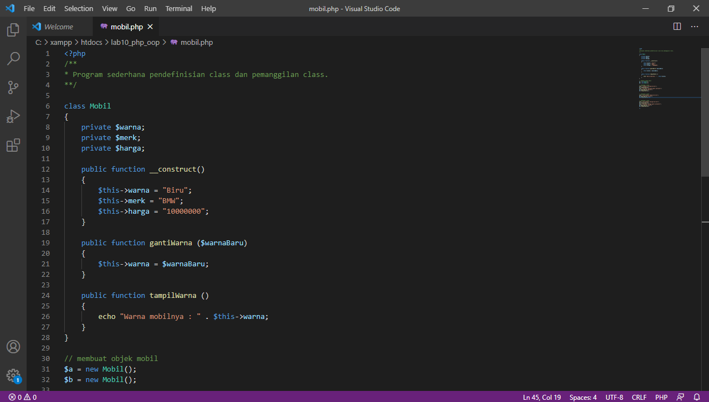
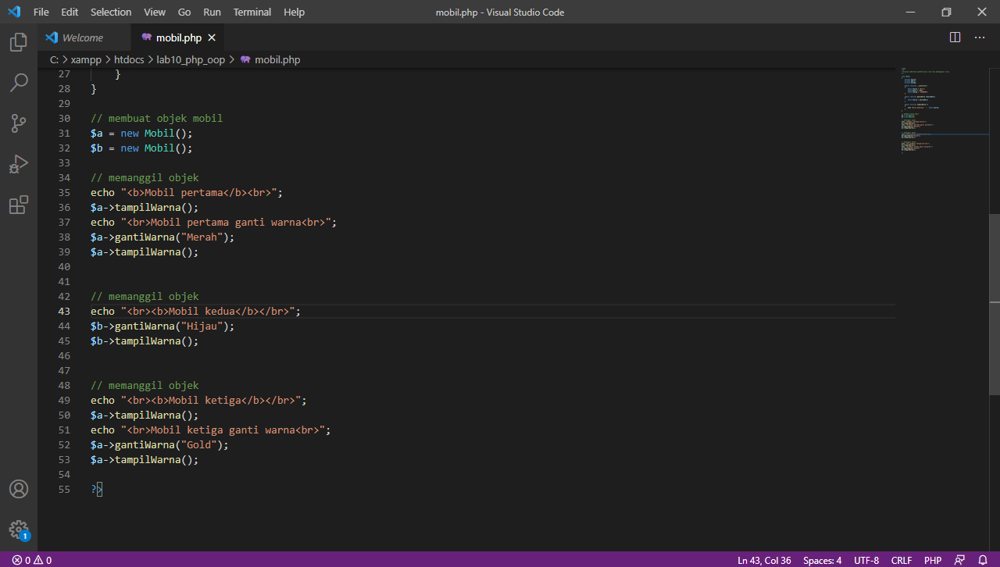
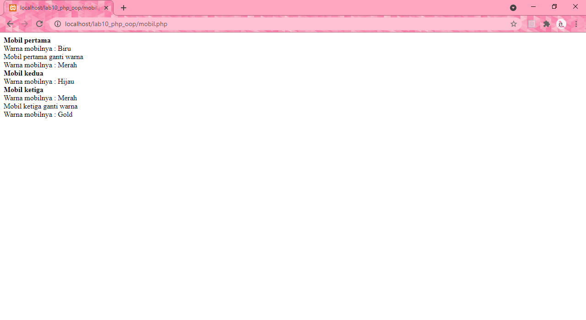
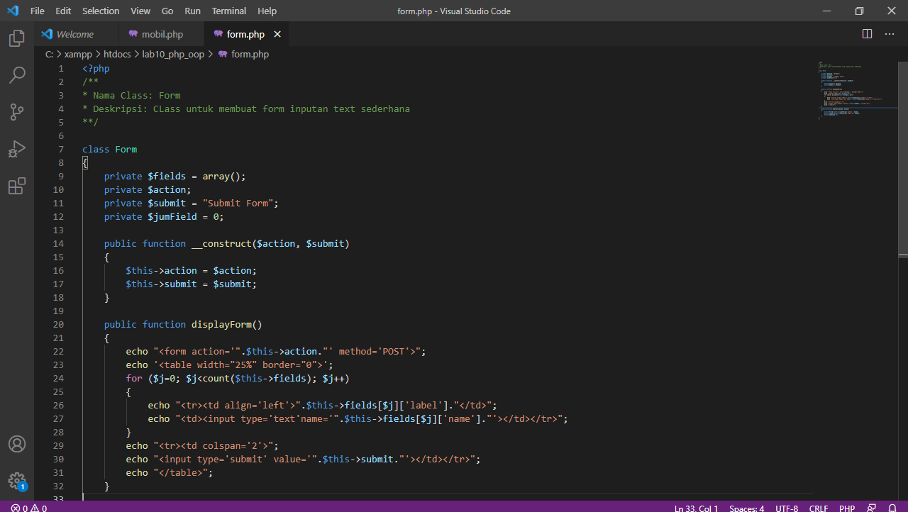
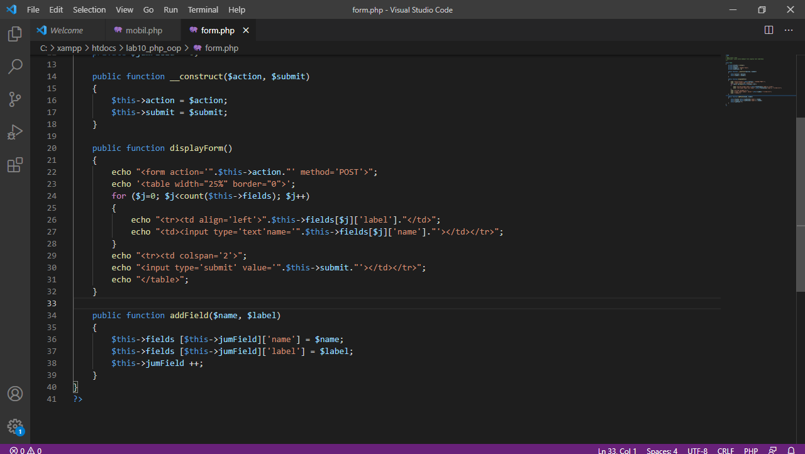
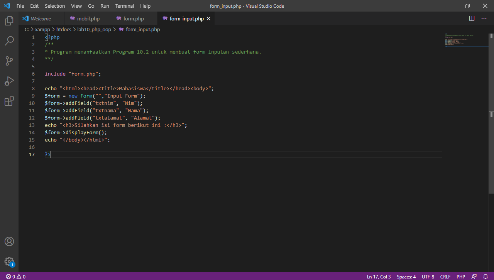
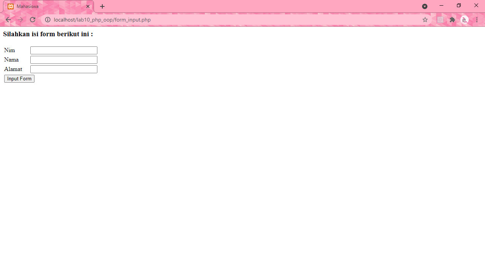
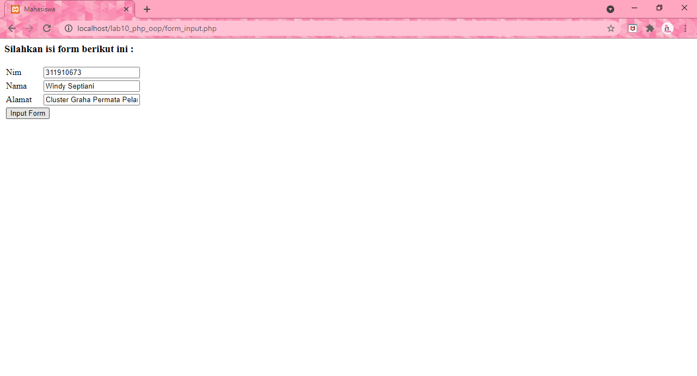

# lab10_php_oop

### Praktikum 9 : PHP OOP

##### Nama  : Windy Septiani
##### NIM   : 311910673
##### Kelas : 19.TI.F1

### Membuat file mobil.php
##### Source code untuk file mobil.php

##### Maka akan tampil seperti ini

### Membuat file form.php
##### Source code untuk file form.php

##### Maka akan tampil seperti ini

### Membuat file form_input.php
##### Source code untuk file form_input.php

##### Maka akan tampil seperti ini

